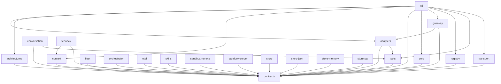

# Nexora 패키지 지도 (agent navigation)

> 에이전트용 라우팅 인덱스. "무엇을 하려면 어느 패키지를 import하고, 어떤 export를 쓰며, 정확한 타입은 어디서 읽는가."
> 패키지 식별자는 전부 **`@dongkseo/*`** (npm org `@nexora` 미생성). 브랜드/CLI 명령은 "Nexora"/`nexora`.

## Capability → Package

| 하려는 것 | import | 핵심 export | 타입 읽기 |
|---|---|---|---|
| 에이전트 런타임 구동·LLM 호출 | `@dongkseo/core` | `bootstrapAgent`, `AgentRunner`, `CoreToolExecutor`, `PiAiProvider`, `FallbackLLMProvider` | `ctx_read("packages/core/src/index.ts", mode="map")` |
| 공유 타입·계약 | `@dongkseo/contracts` | `AgentCard`, store/transport 인터페이스, ID/budget 헬퍼 | `ctx_read("packages/contracts/src/index.ts", mode="map")` |
| 메시지 버스(이벤트 통신) | `@dongkseo/transport` | `LocalTransport`, `RedisStreamsTransport`, `DLQTransport`, `TracingTransport`, `createEnvelope` | `ctx_read("packages/transport/src/index.ts", mode="map")` |
| 에이전트 아키텍처(ReAct) | `@dongkseo/architectures` | `createReactArchitecture` | `ctx_read("packages/architectures/src/index.ts", mode="map")` |
| 테넌트별 persona·tool·limit 로딩 | `@dongkseo/context` | `CoreContextLoader`, `PersonaLoader`, `TenantConfigStore` | `ctx_read("packages/context/src/index.ts", mode="map")` |
| 워크플로 체인(checkpoint/resume)·cron | `@dongkseo/orchestrator` | `WorkflowEngine`, `CronScheduler` | `ctx_read("packages/orchestrator/src/index.ts", mode="map")` |
| 외부 워커 플릿·capability 라우팅 | `@dongkseo/fleet` | 워커 registry·dispatch·HTTP invoker | `ctx_read("packages/fleet/src/index.ts", mode="map")` |
| 도구 레지스트리·내장 도구·MCP·delegate/handraise | `@dongkseo/tools` | `ToolRegistry`, `ToolsetRegistry`, delegate/handraise 도구 | `ctx_read("packages/tools/src/index.ts", mode="map")` |
| 원격/클라우드 워크스페이스 격리(wire 클라이언트) | `@dongkseo/sandbox-remote` | `RemoteSandboxClient` (SandboxClient/WorkspaceProvider를 HTTP wire로 구현; 로컬↔원격 교체) | `ctx_read("packages/sandbox-remote/src/index.ts", mode="map")` |
| sandbox wire 프로토콜 참조 서버 (+ 주입식 OS-격리 backend·세션 lifecycle·네트워크 사이드카) | `@dongkseo/sandbox-server` | `createSandboxServer` (주입식 SandboxClient를 HTTP로 노출; exec/fs/stat/readdir/persist/hydrate/reattach), `OverlayRootfsSandboxClient`+`buildBwrapArgs`(bwrap/overlay), `GvisorSandboxClient`+`buildOciConfig`(runsc/gVisor), `SessionRegistry`, `TarArchiveStore`/`DurableDirStore`, `startEgressProxy`, `startAuthInjectingGateway` | `ctx_read("packages/sandbox-server/src/index.ts", mode="map")` |
| 자가학습 스킬(SKILL.md) | `@dongkseo/skills` | `parseSkillFile`, `loadSkills`, `SkillRegistry`, `SkillCreator`, `buildSkillMenu` | `ctx_read("packages/skills/src/index.ts", mode="map")` |
| 멀티에이전트 대화(턴테이킹) | `@dongkseo/conversation` | `ConversationRoom`, `TurnManager` | `ctx_read("packages/conversation/src/index.ts", mode="map")` |
| 영속 store 번들(설정→백엔드) | `@dongkseo/store` | `createStoreProvider`, `StoreProvider`, `StoreConfig`, `EffectLedger`, `RuntimeInputQueue` | `ctx_read("packages/store/src/index.ts", mode="map")` |
| 개발용 JSON 파일 백엔드 | `@dongkseo/store-json` | JSON store 구현, `EffectLedgerJson` | `ctx_read("packages/store-json/src/index.ts", mode="map")` |
| 운영용 PostgreSQL 백엔드 | `@dongkseo/store-pg` | PG store 구현(+ auto-migration), `EffectLedgerPg` | `ctx_read("packages/store-pg/src/index.ts", mode="map")` |
| 인메모리(그래프/임베딩) 백엔드 | `@dongkseo/store-memory` | 인메모리 store 구현 | `ctx_read("packages/store-memory/src/index.ts", mode="map")` |
| 테넌시 유틸 | `@dongkseo/tenancy` | 테넌트 경계 헬퍼 | `ctx_read("packages/tenancy/src/index.ts", mode="map")` |
| OTel 트레이싱 | `@dongkseo/otel` | `OTelTransport`, agent span middleware | `ctx_read("packages/otel/src/index.ts", mode="map")` |
| HTTP/Discord/Slack 입구 | `@dongkseo/adapters` | `HttpAdapter`, `DiscordAdapter`, `SlackAdapter`, `PaperclipAdapter` | `ctx_read("packages/adapters/src/index.ts", mode="map")` |
| 게이트웨이 라우팅·인증·레이트리밋 | `@dongkseo/gateway` | `GatewayRouter`, `StreamingGatewayRouter`, `createApiKeyAuth`, `createRateLimiter` | `ctx_read("platform/gateway/src/index.ts", mode="map")` |
| 에이전트 레지스트리(인메모리/Redis)·팩토리·capability 라우팅 | `@dongkseo/registry` | `InMemoryAgentRegistry`, `RedisAgentRegistry`, `createAgentRegistry`, `createCapabilityRegistry` | `ctx_read("platform/registry/src/index.ts", mode="map")` |
| 스캐폴드·dev 서버·운영 CLI | `@dongkseo/cli` (bin `nexora`) | `scaffoldAgent`, `runDev`, `runDoctor` …; 명령 `nexora create/dev/doctor/dlq/budget/handraise/export/import` | `ctx_read("platform/cli/src/index.ts", mode="map")` |

## 의존 방향 (정적 deps)

규칙: 모든 패키지는 `contracts`에만 의존하는 것을 기본으로 하고, 위로 갈수록 조립 패키지가 아래를 의존한다. **역방향 import 금지**(예: `contracts`는 무엇도 import하지 않음).



텍스트 인접목록(에이전트가 그래프 렌더 없이 읽는 용):
```
contracts      <- (루트; 무엇도 import 안 함)
adapters       -> contracts, tools
architectures  -> contracts
context        -> contracts
conversation   -> contracts, tools
core           -> contracts
fleet          -> contracts
orchestrator   -> contracts
otel           -> contracts
skills         -> contracts
sandbox-remote -> contracts   (원격 SandboxClient; ContinuousWorkspaceProvider에 주입)
sandbox-server -> contracts   (참조 서버 + 주입식 OS-격리 backend·lifecycle·네트워크 사이드카; 라우트 층 실행은 주입식 SandboxClient에 위임 → 정적 deps는 contracts 하나뿐)
store          -> contracts
store-json     -> contracts
store-memory   -> contracts
store-pg       -> contracts
tenancy        -> context, contracts
tools          -> contracts
transport      -> contracts
gateway        -> adapters, contracts
registry       -> contracts
cli            -> adapters, architectures, context, contracts, core, gateway, registry, tools, transport
```
런타임 동적/optional 간선(정적 deps에 없음): `store ⇢ store-json|store-pg`(동적 import), `otel ⇢ transport`(래핑), `tools ⇢ skills`(`skill_reload` 실행 시 optional peer 로드). 런타임 호스트 요구(패키지 의존성 아님): `sandbox-server`의 `OverlayRootfsSandboxClient`는 `bwrap` 서브프로세스를 spawn하고 커널 기능을 요구하며, egress/auth 사이드카는 unix 소켓을 연다.

## 계층 요청 흐름

```
Adapter (HTTP / Discord / Slack)          @dongkseo/adapters
  → Gateway (auth + rate-limit → route)   @dongkseo/gateway (resolver may use @dongkseo/registry)
    → Transport (Local / Redis / Durable) @dongkseo/transport
      → Bootstrap (subscribe·validate·tenant) @dongkseo/core
        → ContextLoader (persona·limits·tools)  @dongkseo/context
          → AgentRunner (ReAct)               @dongkseo/core (+ @dongkseo/architectures)
            → Tools / Skills                  @dongkseo/tools, @dongkseo/skills
            → Store (conversation·knowledge·audit) @dongkseo/store → store-json | store-pg
          → Result → publish to topic
```

각 패키지 사용법은 그 패키지의 `README.md`. 정확한 타입은 위 표의 `ctx_read(..., mode="signatures")`.

Part of the [Nexora](../../README.md) multi-tenant agent framework.
