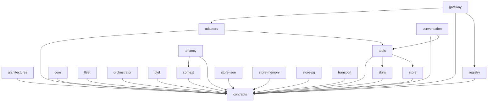

# Nexora agent-first 서브모듈 문서 재정비 — Implementation Plan

> **For agentic workers:** REQUIRED SUB-SKILL: Use superpowers:subagent-driven-development (recommended) or superpowers:executing-plans to implement this plan task-by-task. Steps use checkbox (`- [ ]`) syntax for tracking.

**Goal:** Nexora 서브모듈 문서를 coding agent가 소스 없이 정확히·즉시 활용하도록 재정비한다 (copy-paste-safe 설치 · 통합 지도 · platform stub 확장 · 단일 진입점 · 골격 일관).

**Architecture:** 순수 문서 작업. 코드/패키지 rename 없음. 각 태스크는 "검증 명령이 먼저 실패(RED) → 문서 수정 → 검증 통과(GREEN) → 커밋"의 사이클을 따른다. 테스트 = grep/링크/시그니처 대조 명령.

**Tech Stack:** Markdown, mermaid(GitHub 렌더), `grep`, lean-ctx `ctx_read(mode=signatures)`. 빌드/런타임 변경 없음.

## Global Constraints

- 실제 설치 가능한 패키지 식별자는 **`@dongkseo/<pkg>`** 뿐. 문서의 모든 설치/임포트는 이 이름. (`@nexora` org 미생성)
- **브랜드/제품명 "Nexora"**(슬래시 없음)와 **CLI 명령어 `nexora`**(platform/cli bin)는 보존 — 교정 대상 아님. 교정 대상은 슬래시형 식별자 `@nexora/` 뿐.
- 손대지 않는 과거 기록물: `docs/superpowers/plans/**`, `plan/**`, `.git/**`.
- 스타일: 현행 밀도 높은 agent 지향 유지. 사람용 튜토리얼/산문 확장 금지.
- 타입/시그니처는 README 본문에 베끼지 말고 `ctx_read(path, mode=signatures)` 경로로 안내(정본=소스 TSDoc).
- 작업 브랜치: `docs/agent-first-readmes` (이미 생성됨, 스펙 커밋 `5c77621` 존재).
- 커밋 메시지에 AI 서명/co-author 금지.

## 정본 의존 그래프 (package.json 정적 deps, 수집 완료)

```
contracts      -> (none, 루트)
adapters       -> contracts, tools
architectures  -> contracts
context        -> contracts
conversation   -> contracts, tools
core           -> contracts
fleet          -> contracts
orchestrator   -> contracts
otel           -> contracts
skills         -> contracts
store          -> contracts
store-json     -> contracts
store-memory   -> contracts
store-pg       -> contracts
tenancy        -> context, contracts
tools          -> contracts, skills, store
transport      -> contracts
gateway        -> adapters, contracts, registry
registry       -> contracts
cli            -> (정적 deps 없음; 런타임에 core/transport 사용)
```
런타임 동적 간선(정적 deps에 없음): `store ⇢ store-json|store-pg`(동적 import), `otel ⇢ transport`(래핑), `cli ⇢ core|transport`(dev 부팅). 지도에 주석으로 명시.

---

## Task 1: P0 — 라이브 문서 `@nexora/` → `@dongkseo/` 교정

에이전트가 복사하는 설치 식별자를 실제 설치 가능 이름으로. platform README 3개는 Task 3에서 통째로 재작성하므로 여기서 제외.

**Files:**
- Modify: `README.md`
- Modify: `docs/getting-started.md`
- Modify: `docs/architecture/agent-lifecycle.md`, `docs/architecture/oracle-syscall-contract.md`, `docs/architecture/package-spec.md`, `docs/architecture/public-api.md`, `docs/architecture/stability.md`
- Modify: `examples/personal-assistant/README.md`
- Test: grep 검증(라이브 집합에서 `@nexora/` 0건)

**Interfaces:**
- Produces: 라이브 문서 전반에서 패키지 식별자가 `@dongkseo/*`로 통일 → Task 2~5의 모든 새 문서가 이 이름 규약을 따른다.

- [ ] **Step 1: 현재 `@nexora/` 분포 확인 (RED)**

Run:
```bash
cd /Users/dongkseo99/work/nexora
grep -rn '@nexora/' README.md docs/getting-started.md docs/architecture examples/personal-assistant/README.md
```
Expected: 다수 매치(루트 README ~30+건, getting-started, architecture/*, personal-assistant). 이 매치들이 제거 대상.

- [ ] **Step 2: 슬래시형 식별자만 일괄 치환**

`@nexora/`(슬래시 포함)만 바꾼다. 브랜드 "Nexora"는 슬래시가 없어 영향 없음.
```bash
cd /Users/dongkseo99/work/nexora
for f in README.md docs/getting-started.md \
  docs/architecture/agent-lifecycle.md docs/architecture/oracle-syscall-contract.md \
  docs/architecture/package-spec.md docs/architecture/public-api.md docs/architecture/stability.md \
  examples/personal-assistant/README.md; do
  sed -i '' 's,@nexora/,@dongkseo/,g' "$f"
done
```

- [ ] **Step 3: 라이브 집합에 `@nexora/` 0건 확인 (GREEN)**

Run:
```bash
cd /Users/dongkseo99/work/nexora
grep -rn '@nexora/' README.md docs/getting-started.md docs/architecture examples/personal-assistant/README.md; echo "exit=$?"
```
Expected: 출력 없음, `exit=1` (grep 매치 없음). 브랜드 "Nexora"는 그대로 남아야 정상(슬래시 없는 "Nexora" 검색으로 보존 확인): `grep -c 'Nexora' README.md` > 0.

- [ ] **Step 4: 깨진 내부 링크 점검**

루트 README·getting-started가 가리키는 docs 경로가 실존하는지 확인:
```bash
cd /Users/dongkseo99/work/nexora
for p in docs/architecture/public-api.md docs/architecture/ examples/helpdesk/ examples/personal-assistant/; do test -e "$p" && echo "OK $p" || echo "MISSING $p"; done
```
Expected: 전부 `OK`. `MISSING`이 나오면 해당 링크를 실제 존재 파일로 교정하거나 제거.

- [ ] **Step 5: 커밋**

```bash
cd /Users/dongkseo99/work/nexora
git add README.md docs/getting-started.md docs/architecture examples/personal-assistant/README.md
git commit -m "docs(p0): use installable @dongkseo/* package ids in live docs"
```

---

## Task 2: P1 — 통합 지도 `docs/architecture/packages-map.md`

에이전트 라우팅 인덱스: capability→패키지→export→signatures + 의존 그래프(mermaid+텍스트) + 계층 흐름.

**Files:**
- Create: `docs/architecture/packages-map.md`
- Test: grep(파일 내 `@nexora/` 0) + 링크 해석 확인

**Interfaces:**
- Consumes: Task 1의 `@dongkseo/*` 이름 규약, 위 "정본 의존 그래프".
- Produces: `docs/architecture/packages-map.md` — Task 3·4의 README 푸터/AGENTS.md가 이 경로를 링크.

- [ ] **Step 1: 지도 부재 확인 (RED)**

Run: `test -e docs/architecture/packages-map.md && echo EXISTS || echo MISSING`
Expected: `MISSING`.

- [ ] **Step 2: 지도 작성**

Create `docs/architecture/packages-map.md`:

````markdown
# Nexora 패키지 지도 (agent navigation)

> 에이전트용 라우팅 인덱스. "무엇을 하려면 어느 패키지를 import하고, 어떤 export를 쓰며, 정확한 타입은 어디서 읽는가."
> 패키지 식별자는 전부 **`@dongkseo/*`** (npm org `@nexora` 미생성). 브랜드/CLI 명령은 "Nexora"/`nexora`.

## Capability → Package

| 하려는 것 | import | 핵심 export | 타입 읽기 |
|---|---|---|---|
| 에이전트 런타임 구동·LLM 호출 | `@dongkseo/core` | `bootstrapAgent`, `AgentRunner`, `CoreToolExecutor`, `PiAiProvider`, `FallbackLLMProvider` | `ctx_read("packages/core/src/index.ts", mode="map")` |
| 공유 타입·계약 | `@dongkseo/contracts` | `AgentCard`, store/transport 인터페이스, ID/budget 헬퍼 | `ctx_read("packages/contracts/src/index.ts", mode="map")` |
| 메시지 버스(이벤트 통신) | `@dongkseo/transport` | `LocalTransport`, `RedisStreamsTransport`, `DLQTransport`, `TracingTransport`, `createEnvelope` | `ctx_read("packages/transport/src/index.ts", mode="map")` |
| 에이전트 아키텍처(ReAct) | `@dongkseo/architectures` | `createReactArchitecture` | `ctx_read("packages/architectures/src/index.ts", mode="map")` |
| 테넌트별 persona·tool·limit 로딩 | `@dongkseo/context` | `CoreContextLoader`, `PersonaLoader`, `TenantConfigStore` | `ctx_read("packages/context/src/index.ts", mode="map")` |
| 워크플로 체인(checkpoint/resume)·cron | `@dongkseo/orchestrator` | `WorkflowEngine`, `CronScheduler` | `ctx_read("packages/orchestrator/src/index.ts", mode="map")` |
| 외부 워커 플릿·capability 라우팅 | `@dongkseo/fleet` | 워커 registry·dispatch·HTTP invoker | `ctx_read("packages/fleet/src/index.ts", mode="map")` |
| 도구 레지스트리·내장 도구·MCP·delegate/handraise | `@dongkseo/tools` | `ToolRegistry`, `ToolsetRegistry`, delegate/handraise 도구 | `ctx_read("packages/tools/src/index.ts", mode="map")` |
| 자가학습 스킬(SKILL.md) | `@dongkseo/skills` | `SkillLoader`, `SkillRegistry`, `SkillCreator` | `ctx_read("packages/skills/src/index.ts", mode="map")` |
| 멀티에이전트 대화(턴테이킹) | `@dongkseo/conversation` | `ConversationRoom`, `TurnManager` | `ctx_read("packages/conversation/src/index.ts", mode="map")` |
| 영속 store 번들(설정→백엔드) | `@dongkseo/store` | `createStoreProvider`, `StoreProvider`, `StoreConfig` | `ctx_read("packages/store/src/index.ts", mode="map")` |
| 개발용 JSON 파일 백엔드 | `@dongkseo/store-json` | JSON store 구현 | `ctx_read("packages/store-json/src/index.ts", mode="map")` |
| 운영용 PostgreSQL 백엔드 | `@dongkseo/store-pg` | PG store 구현(+ auto-migration) | `ctx_read("packages/store-pg/src/index.ts", mode="map")` |
| 인메모리(그래프/임베딩) 백엔드 | `@dongkseo/store-memory` | 인메모리 store 구현 | `ctx_read("packages/store-memory/src/index.ts", mode="map")` |
| 테넌시 유틸 | `@dongkseo/tenancy` | 테넌트 경계 헬퍼 | `ctx_read("packages/tenancy/src/index.ts", mode="map")` |
| OTel 트레이싱 | `@dongkseo/otel` | `OTelTransport`, agent span middleware | `ctx_read("packages/otel/src/index.ts", mode="map")` |
| HTTP/Discord/Slack 입구 | `@dongkseo/adapters` | `HttpAdapter`, `DiscordAdapter`, `SlackAdapter`, `PaperclipAdapter` | `ctx_read("packages/adapters/src/index.ts", mode="map")` |
| 게이트웨이 라우팅·인증·레이트리밋 | `@dongkseo/gateway` | `GatewayRouter`, `StreamingGatewayRouter`, `createApiKeyAuth`, `createRateLimiter` | `ctx_read("platform/gateway/src/index.ts", mode="map")` |
| 에이전트 레지스트리 | `@dongkseo/registry` | `InMemoryAgentRegistry` | `ctx_read("platform/registry/src/index.ts", mode="map")` |
| 스캐폴드·dev 서버·운영 CLI | `@dongkseo/cli` (bin `nexora`) | `scaffoldAgent`, `runDev`, `runDoctor` …; 명령 `nexora create/dev/doctor/dlq/budget/handraise/export/import` | `ctx_read("platform/cli/src/index.ts", mode="map")` |

## 의존 방향 (정적 deps)

규칙: 모든 패키지는 `contracts`에만 의존하는 것을 기본으로 하고, 위로 갈수록 조립 패키지가 아래를 의존한다. **역방향 import 금지**(예: `contracts`는 무엇도 import하지 않음).



텍스트 인접목록(에이전트가 그래프 렌더 없이 읽는 용): 위 "정본 의존 그래프" 블록과 동일.
런타임 동적 간선(정적 deps에 없음): `store ⇢ store-json|store-pg`(동적 import), `otel ⇢ transport`(래핑), `cli ⇢ core|transport`(dev 부팅).

## 계층 요청 흐름

```
Adapter (HTTP / Discord / Slack)          @dongkseo/adapters
  → Gateway (auth + rate-limit → route)   @dongkseo/gateway (+ @dongkseo/registry)
    → Transport (Local / Redis / Durable) @dongkseo/transport
      → Bootstrap (subscribe·validate·tenant) @dongkseo/core
        → ContextLoader (persona·limits·tools)  @dongkseo/context
          → AgentRunner (ReAct)               @dongkseo/core (+ @dongkseo/architectures)
            → Tools / Skills                  @dongkseo/tools, @dongkseo/skills
            → Store (conversation·knowledge·audit) @dongkseo/store → store-json | store-pg
          → Result → publish to topic
```

각 패키지 사용법은 그 패키지의 `README.md`. 정확한 타입은 위 표의 `ctx_read(..., mode="signatures")`.

Part of the [Nexora](../../README.md) multi-tenant agent framework.
````

- [ ] **Step 3: 검증 (GREEN)**

Run:
```bash
cd /Users/dongkseo99/work/nexora
test -e docs/architecture/packages-map.md && echo EXISTS
grep -c '@nexora/' docs/architecture/packages-map.md   # expect 0
grep -c '@dongkseo/' docs/architecture/packages-map.md  # expect >=20
```
Expected: `EXISTS`, `@nexora/` = 0, `@dongkseo/` ≥ 20.

- [ ] **Step 4: 커밋**

```bash
cd /Users/dongkseo99/work/nexora
git add docs/architecture/packages-map.md
git commit -m "docs(p1): add agent navigation package map (capability+deps+flow)"
```

---

## Task 3: P1 — platform stub 3개를 골격으로 확장

`cli`/`gateway`/`registry` README(18줄)를 실제 export 기준 리치 템플릿으로. `@nexora`도 여기서 함께 교정됨.

**Files:**
- Modify: `platform/registry/README.md`
- Modify: `platform/gateway/README.md`
- Modify: `platform/cli/README.md`
- Test: 시그니처 대조 + 섹션/이름 grep

**Interfaces:**
- Consumes: 실제 export — registry: `InMemoryAgentRegistry`; gateway: `GatewayRouter`, `LocalRuntimeRouter`, `StreamingGatewayRouter`, `createMentionResolver`, `createApiKeyAuth`, `createRateLimiter`, `createSecureResolver`, `RateLimitError`; cli: `scaffoldAgent`, `runDev`, `runDoctor`, `viewDlq`, `viewBudget`, `viewHandraises`, `exportPackage`, `importPackage` (+ bin `nexora`).
- Produces: 3개 README가 §골격 준수.

- [ ] **Step 1: 현재 export와 stub 상태 확인 (RED)**

Run:
```bash
cd /Users/dongkseo99/work/nexora
wc -l platform/registry/README.md platform/gateway/README.md platform/cli/README.md
grep -n '@nexora/' platform/*/README.md
```
Expected: 각 18줄, `@nexora/` 매치 존재. (필요시 정확 export 재확인: `ctx_read("platform/gateway/src/index.ts", mode="map")` 등.)

- [ ] **Step 2: `platform/registry/README.md` 작성**

````markdown
# @dongkseo/registry

**Stability: stable** · `pnpm add @dongkseo/registry`

> 이 파일은 에이전트(사람·LLM)가 소스를 열지 않고도 이 패키지를 쓸 수 있게 하는 오리엔테이션 문서다.
> 정확한 API 타입은 "API 표면"의 방법으로 `signatures`만 읽어라 — 본문을 베끼지 말 것.

## 무엇인가 / 무엇이 아닌가

에이전트 카드(AgentCard)의 **레지스트리**다. 이름·capability·구독 토픽으로 에이전트를 등록·조회한다.

- ✅ 담는 것: 인메모리 AgentRegistry 구현(`InMemoryAgentRegistry`)과 등록/조회 API
- ❌ 안 담는 것: AgentCard 타입 정의(→ `@dongkseo/contracts`), 라우팅/게이트웨이(→ `@dongkseo/gateway`), capability 매칭 기반 워커 dispatch(→ `@dongkseo/fleet`)

의존 방향: **registry → contracts** 단방향. `@dongkseo/gateway`가 registry에 의존한다.

## 핵심 개념

| 개념 | 무엇 | 대표 export |
| --- | --- | --- |
| **AgentRegistry** | 이름/capability/구독 토픽으로 AgentCard를 등록·조회하는 인메모리 저장소 | `InMemoryAgentRegistry` |

메서드: `register(card)`, `unregister(name)`, `get(name)`, `list()`, `findByCapability(capability)`, `findBySubscription(topic)`.

## 사용 레시피

```ts
import { InMemoryAgentRegistry } from '@dongkseo/registry';
import type { AgentCard } from '@dongkseo/contracts';

const registry = new InMemoryAgentRegistry();
await registry.register(card);                      // AgentCard 등록

const coder = await registry.get('coder');          // 이름으로 조회 (없으면 null)
const writers = await registry.findByCapability('write');   // capability로 필터
const subs = await registry.findBySubscription('agent.task'); // 토픽 구독자
const all = await registry.list();
```

## API 표면 (소스 안 열고 타입만)

```
ctx_read(path="platform/registry/src/index.ts", mode="signatures")   # InMemoryAgentRegistry
```
`AgentCard` 타입은 `ctx_read(path="packages/contracts/src/index.ts", mode="map")`.

## 유지보수 (drift 방지)

- 이 README = 목적·개념·레시피만. API 정본은 소스 TSDoc.
- 새 export가 생기면 `src/index.ts` 상단/이 표에 한 줄만 추가.

## Tests

```bash
cd platform/registry && pnpm test
```

Part of the [Nexora](../../README.md) multi-tenant agent framework. · [Package map](../../docs/architecture/packages-map.md)
````

- [ ] **Step 3: `platform/gateway/README.md` 작성**

````markdown
# @dongkseo/gateway

**Stability: stable** · `pnpm add @dongkseo/gateway`

> 이 파일은 에이전트(사람·LLM)가 소스를 열지 않고도 이 패키지를 쓸 수 있게 하는 오리엔테이션 문서다.
> 정확한 API 타입은 "API 표면"의 방법으로 `signatures`만 읽어라 — 본문을 베끼지 말 것.

## 무엇인가 / 무엇이 아닌가

외부 진입점(어댑터)과 에이전트 시스템 사이의 **라우터 + 게이트 미들웨어**다. inbound 메시지를 토픽으로 라우팅하고, API 키 인증·레이트리밋을 건다.

- ✅ 담는 것: `GatewayRouter`(transport로 발행), `LocalRuntimeRouter`(transport 없이 런타임 직접 호출·스트리밍), `StreamingGatewayRouter`, 의도 해석기(`createMentionResolver`), 인증·레이트리밋 미들웨어
- ❌ 안 담는 것: HTTP/Discord 등 채널 어댑터(→ `@dongkseo/adapters`), 에이전트 레지스트리 구현(→ `@dongkseo/registry`), 트랜스포트 구현(→ `@dongkseo/transport`)

의존 방향: **gateway → adapters, registry, contracts**.

## 핵심 개념

| 개념 | 무엇 | 대표 export |
| --- | --- | --- |
| **GatewayRouter** | InboundMessage → 토픽 발행 → 응답 수신 (transport 경유) | `GatewayRouter`, `GatewayRouterOptions` |
| **LocalRuntimeRouter** | transport 없이 AgentRuntime 직접 호출(단일 프로세스·스트리밍) | `LocalRuntimeRouter`, `LocalRuntimeRouterOptions` |
| **StreamingGatewayRouter** | 스트리밍 응답 라우터 | `StreamingGatewayRouter`, `StreamingGatewayRouterOptions` |
| **의도 해석기** | 어느 에이전트로 보낼지 결정(멘션 기반 기본 구현) | `createMentionResolver`, `IntentResolver` |
| **게이트 미들웨어** | API 키 인증·레이트리밋·보안 resolver | `createApiKeyAuth`, `createRateLimiter`, `createSecureResolver`, `RateLimitError` |

## 사용 레시피

API 키 인증 + 레이트리밋을 건 게이트웨이 라우터:

```ts
import {
  GatewayRouter, createMentionResolver,
  createApiKeyAuth, createRateLimiter,
} from '@dongkseo/gateway';
import { LocalTransport } from '@dongkseo/transport';

const transport = new LocalTransport();
const router = new GatewayRouter({
  transport,
  resolver: createMentionResolver(),         // 멘션→토픽
  auth: createApiKeyAuth({ keys: [process.env.API_KEY!] }),
  rateLimiter: createRateLimiter({ windowMs: 60_000, max: 60 }), // 초과 시 RateLimitError(429)
});

const reply = await router.handle({ content: '@coder 버그 고쳐줘', apiKey: process.env.API_KEY! });
```

transport 없이 단일 프로세스로 런타임을 직접 호출하려면 `LocalRuntimeRouter`(스트리밍 지원).

## API 표면 (소스 안 열고 타입만)

```
ctx_read(path="platform/gateway/src/index.ts",            mode="map")        # 전체 export
ctx_read(path="platform/gateway/src/router.ts",           mode="signatures") # GatewayRouter, LocalRuntimeRouter, createMentionResolver
ctx_read(path="platform/gateway/src/streaming-router.ts", mode="signatures") # StreamingGatewayRouter
ctx_read(path="platform/gateway/src/middleware.ts",       mode="signatures") # createApiKeyAuth, createRateLimiter, createSecureResolver, RateLimitError
```

## 유지보수 (drift 방지)

- 이 README = 목적·개념·레시피만. API 정본은 소스 TSDoc.
- 새 export가 생기면 `src/index.ts` 상단 맵/이 표에 한 줄만 추가.

## Tests

```bash
cd platform/gateway && pnpm test
```

Part of the [Nexora](../../README.md) multi-tenant agent framework. · [Package map](../../docs/architecture/packages-map.md)
````

- [ ] **Step 4: `platform/cli/README.md` 작성**

````markdown
# @dongkseo/cli

**Stability: stable** · `pnpm add @dongkseo/cli` · bin: `nexora`

> 이 파일은 에이전트(사람·LLM)가 소스를 열지 않고도 이 패키지를 쓸 수 있게 하는 오리엔테이션 문서다.
> CLI는 라이브러리가 아니라 **명령** 중심이다. 정확한 프로그래매틱 타입은 `signatures`로 읽어라.

## 무엇인가 / 무엇이 아닌가

Nexora 개발/운영 **CLI**다. 에이전트를 스캐폴드하고, dev 서버를 띄우고, 진단·DLQ·예산·handraise를 본다. 같은 기능을 코드에서 부를 수 있게 프로그래매틱 API도 export한다.

- ✅ 담는 것: `nexora` 명령(create/dev/doctor/dlq/budget/handraise/export/import), 프로그래매틱 함수(`scaffoldAgent`, `runDev`, `runDoctor`, `viewDlq`, `viewBudget`, `viewHandraises`, `exportPackage`, `importPackage`)
- ❌ 안 담는 것: 런타임 엔진(→ `@dongkseo/core`), 트랜스포트(→ `@dongkseo/transport`), 게이트웨이(→ `@dongkseo/gateway`)

## 핵심 개념 (명령 ↔ 프로그래매틱 API)

| 명령 | 무엇 | 프로그래매틱 export |
| --- | --- | --- |
| `nexora create agent <name>` | 에이전트 스캐폴드 | `scaffoldAgent` |
| `nexora dev` | dev 서버 부팅(어댑터+로컬 트랜스포트) | `runDev` |
| `nexora doctor` | 환경/설정 진단 | `runDoctor` |
| `nexora dlq` | dead-letter 큐 조회 | `viewDlq` |
| `nexora budget` | 예산 사용 조회 | `viewBudget` |
| `nexora handraise` | 대기 중 handraise 조회 | `viewHandraises` |
| `nexora export` / `import` | 에이전트 패키지 내보내기/가져오기 | `exportPackage` / `importPackage` |

## 사용 레시피

CLI:
```bash
npx nexora create agent my-agent --tools read,grep
npx nexora dev
# 다른 터미널
curl -X POST localhost:3000/messages -H 'Content-Type: application/json' -d '{"content":"hello"}'
```

프로그래매틱(다른 도구에서 스캐폴딩 호출):
```ts
import { scaffoldAgent, runDev } from '@dongkseo/cli';

await scaffoldAgent({ name: 'my-agent', tools: ['read', 'grep'] });
await runDev();
```

## API 표면 (소스 안 열고 타입만)

```
ctx_read(path="platform/cli/src/index.ts",        mode="map")          # 프로그래매틱 export 전체
ctx_read(path="platform/cli/src/scaffold.ts",     mode="signatures")   # scaffoldAgent, ScaffoldOptions
ctx_read(path="platform/cli/src/ops.ts",          mode="signatures")   # runDoctor, viewDlq, viewBudget, viewHandraises
ctx_read(path="platform/cli/src/portability.ts",  mode="signatures")   # exportPackage, importPackage
```
CLI 진입점(명령 파싱)은 `src/cli.ts` (bin `nexora`).

## 유지보수 (drift 방지)

- 이 README = 목적·명령·레시피만. API 정본은 소스 TSDoc.
- 새 명령/함수가 생기면 이 표와 `src/index.ts`에 한 줄만 추가.

## Tests

```bash
cd platform/cli && pnpm test
```

Part of the [Nexora](../../README.md) multi-tenant agent framework. · [Package map](../../docs/architecture/packages-map.md)
````

- [ ] **Step 5: 검증 (GREEN)**

Run:
```bash
cd /Users/dongkseo99/work/nexora
grep -L '@nexora/' platform/registry/README.md platform/gateway/README.md platform/cli/README.md  # 3개 모두 출력돼야(=매치 없음)
for f in platform/registry/README.md platform/gateway/README.md platform/cli/README.md; do
  echo "== $f =="; grep -c '## 무엇인가 / 무엇이 아닌가\|## 핵심 개념\|## 사용 레시피\|## API 표면\|## 유지보수\|## Tests' "$f"
done
grep -c 'InMemoryAgentRegistry' platform/registry/README.md   # >=1
grep -c 'GatewayRouter' platform/gateway/README.md            # >=1
grep -c 'scaffoldAgent' platform/cli/README.md                # >=1
```
Expected: 세 파일 모두 `@nexora/` 무매치(파일명이 `grep -L`에 나옴), 각 핵심 섹션 헤더 6개 존재, 실제 export 이름 매치.

- [ ] **Step 6: 커밋**

```bash
cd /Users/dongkseo99/work/nexora
git add platform/registry/README.md platform/gateway/README.md platform/cli/README.md
git commit -m "docs(p1): expand platform cli/gateway/registry READMEs to canonical skeleton"
```

---

## Task 4: P1 — 루트 `AGENTS.md` 진입점 + 모든 README 푸터에 지도 링크

**Files:**
- Create: `AGENTS.md`
- Modify: 14개 리치 README(`packages/*/README.md`)의 푸터 (platform 3개는 Task 3에서 이미 링크 추가됨)
- Test: 도달성 grep

**Interfaces:**
- Consumes: `docs/architecture/packages-map.md`(Task 2).
- Produces: 단일 진입점 `AGENTS.md` → 지도 → README → signatures 사슬.

- [ ] **Step 1: 진입점 부재 확인 (RED)**

Run: `test -e AGENTS.md && echo EXISTS || echo MISSING`
Expected: `MISSING`.

- [ ] **Step 2: `AGENTS.md` 작성**

````markdown
# AGENTS.md — Nexora를 쓰는 코딩 에이전트용 진입점

이 저장소는 **Nexora**(멀티테넌트 TypeScript 에이전트 프레임워크)다. 코딩 에이전트가 소스를 다 읽지 않고도 패키지를 정확히 쓰도록 라우팅한다.

## 가장 먼저 알 것

- **설치 가능한 패키지 식별자는 `@dongkseo/*` 뿐.** (`@nexora` npm org는 아직 없음.) 문서에 `@nexora/x`가 보이면 `@dongkseo/x`로 읽어라 — 그대로 설치하면 실패한다.
- 브랜드/제품명은 "Nexora", CLI 명령어는 `nexora`(이건 정상).

## 어디서 무엇을 찾나

1. **"X를 하려면 어느 패키지?"** → [`docs/architecture/packages-map.md`](docs/architecture/packages-map.md) 의 capability 표.
2. **한 패키지 쓰는 법** → 그 패키지의 README: `packages/<name>/README.md` 또는 `platform/<name>/README.md`.
3. **정확한 타입/시그니처** → README 본문을 베끼지 말고 `ctx_read(path, mode="signatures")` (또는 `mode="map"`)로 소스에서 직접. 정본은 소스 TSDoc.
4. **전체 그림(의존 방향·계층 흐름)** → 같은 지도 문서의 그래프/흐름 섹션. 역방향 import 금지(모두 `contracts`로 수렴).

## 최소 시작(3 패키지)

```bash
pnpm add @dongkseo/contracts @dongkseo/core @dongkseo/transport
```
나머지는 필요할 때 지도 표를 보고 하나씩 추가.

## README 규약

모든 패키지 README는 동일 골격을 따른다: **무엇인가/아닌가 · 핵심 개념 · 사용 레시피 · API 표면 · 유지보수 · Tests**. 템플릿: [`docs/architecture/README-template.md`](docs/architecture/README-template.md).
````

- [ ] **Step 3: 리치 README 14개 푸터에 지도 링크 추가**

기존 공통 푸터 줄에 지도 링크를 덧붙인다(이미 링크가 있으면 건너뜀):
```bash
cd /Users/dongkseo99/work/nexora
for f in packages/*/README.md; do
  grep -q 'Package map' "$f" && continue
  sed -i '' 's,^Part of the \[Nexora\](../../README.md) multi-tenant agent framework\.$,Part of the [Nexora](../../README.md) multi-tenant agent framework. · [Package map](../../docs/architecture/packages-map.md),' "$f"
done
```

- [ ] **Step 4: 도달성 검증 (GREEN)**

Run:
```bash
cd /Users/dongkseo99/work/nexora
test -e AGENTS.md && echo "AGENTS ok"
grep -c 'packages-map.md' AGENTS.md                 # >=1
grep -rl 'Package map' packages/*/README.md platform/*/README.md | wc -l   # 17 기대
test -e docs/architecture/packages-map.md && echo "map ok"
```
Expected: `AGENTS ok`, `map ok`, 푸터 링크 17개 파일. (17 미만이면 누락 README의 푸터 줄 형식이 달라서이니 해당 파일을 직접 Edit로 링크 추가.)

- [ ] **Step 5: 커밋**

```bash
cd /Users/dongkseo99/work/nexora
git add AGENTS.md packages/*/README.md
git commit -m "docs(p1): add root AGENTS.md entrypoint and link package map in README footers"
```

---

## Task 5: P2 — README 골격 템플릿 명문화 + 리치 14개 스팟체크

**Files:**
- Create: `docs/architecture/README-template.md`
- Modify: (스팟체크에서 누락 슬롯이 발견된 리치 README만)
- Test: 17개 README 섹션 헤더 존재 확인

**Interfaces:**
- Consumes: Task 1~4 결과.
- Produces: 신규 패키지 표류 방지용 정본 템플릿.

- [ ] **Step 1: 템플릿 부재 확인 (RED)**

Run: `test -e docs/architecture/README-template.md && echo EXISTS || echo MISSING`
Expected: `MISSING`.

- [ ] **Step 2: `docs/architecture/README-template.md` 작성**

````markdown
# 패키지 README 골격 템플릿 (정본)

모든 `packages/*`·`platform/*` README는 이 골격을 따른다. 에이전트가 슬롯 위치로 정보를 추출하므로 **섹션 제목·순서를 바꾸지 말 것**. 패키지 식별자는 `@dongkseo/*`.

```markdown
# @dongkseo/<pkg>

**Stability: <stable|advanced|experimental>** · `pnpm add @dongkseo/<pkg>`

> 이 파일은 에이전트(사람·LLM)가 소스를 열지 않고도 이 패키지를 쓸 수 있게 하는 오리엔테이션 문서다.
> 정확한 API 타입은 "API 표면"의 방법으로 `signatures`만 읽어라 — 본문을 베끼지 말 것.

## 무엇인가 / 무엇이 아닌가
- ✅ 담는 것: …
- ❌ 안 담는 것: … (→ 어느 패키지로 가야 하는지)
의존 방향: **<pkg> → …** 단방향.

## 핵심 개념
| 개념 | 무엇 | 대표 export |
| --- | --- | --- |
| … | … | … |

## 사용 레시피
(임포트 포함 실제 동작 코드. 가능하면 examples/ 경로 참조)

## API 표면 (소스 안 열고 타입만)
ctx_read(path="<...>/src/index.ts", mode="map")
ctx_read(path="<...>/src/<file>.ts", mode="signatures")

## 유지보수 (drift 방지)
- 이 README = 목적·개념·레시피만. API 정본은 소스 TSDoc.
- 새 export가 생기면 src/index.ts 상단 맵/이 표에 한 줄만 추가.

## Tests
\`\`\`bash
cd <path> && pnpm test
\`\`\`

Part of the [Nexora](../../README.md) multi-tenant agent framework. · [Package map](../../docs/architecture/packages-map.md)
```

## 불변식 (agent-consumability)
- 설치/임포트 식별자는 `@dongkseo/*` (copy-paste-safe).
- "무엇이 아닌가" + 의존 방향으로 잘못된 패키지 import를 막는다.
- 타입은 본문 복제 금지, `signatures` 포인터로.
- 레시피는 실재 export만 사용.
````

- [ ] **Step 3: 17개 README 골격 스팟체크 (GREEN)**

Run:
```bash
cd /Users/dongkseo99/work/nexora
for f in packages/*/README.md platform/*/README.md; do
  miss=""
  for h in "## 무엇인가 / 무엇이 아닌가" "## 핵심 개념" "## 사용 레시피" "## API 표면" "## 유지보수" "## Tests"; do
    grep -qF "$h" "$f" || miss="$miss [$h]"
  done
  [ -n "$miss" ] && echo "MISSING in $f:$miss"
done; echo "spotcheck done"
```
Expected: 이상적으로 `MISSING` 줄 없음. (단, lean-ctx 셸 allowlist가 `[`를 막으면 이 스크립트는 일반 zsh에서 실행하거나, 각 헤더를 개별 `grep -lF`로 확인.) `MISSING`이 뜬 리치 README는 누락 섹션만 골격에 맞춰 보강 후 그 파일을 `git add`.

- [ ] **Step 4: 커밋**

```bash
cd /Users/dongkseo99/work/nexora
git add docs/architecture/README-template.md packages/ platform/
git commit -m "docs(p2): document canonical README skeleton template + skeleton spot-check fixes"
```

---

## 완료 후

전체 검증 1회:
```bash
cd /Users/dongkseo99/work/nexora
echo "live @nexora/ (expect 0):"; grep -rn '@nexora/' README.md AGENTS.md docs/architecture docs/getting-started.md packages platform examples 2>/dev/null | grep -v node_modules | wc -l
echo "map reachable:"; test -e AGENTS.md && test -e docs/architecture/packages-map.md && echo ok
```
그 후 `superpowers:finishing-a-development-branch`로 머지/PR 결정.

## Self-Review (작성자 점검 완료)

- **Spec coverage:** P0 정확성=Task1, ②지도=Task2, ①platform=Task3, AGENTS.md=Task4, P2 템플릿/스팟체크=Task5. 비목표(rename·산문확장·전수감사) 모두 미포함 확인. ✅
- **Placeholder scan:** 모든 문서 산출물의 실제 내용 포함(AGENTS.md·지도·3 README·템플릿 전문). "TBD"류 없음. ✅
- **Type/이름 일관성:** export 이름은 시그니처에서 직접 수집(InMemoryAgentRegistry / GatewayRouter·LocalRuntimeRouter·StreamingGatewayRouter·createMentionResolver·createApiKeyAuth·createRateLimiter·createSecureResolver·RateLimitError / scaffoldAgent·runDev·runDoctor·viewDlq·viewBudget·viewHandraises·exportPackage·importPackage). 지도/README/AGENTS.md 간 동일 사용. ✅
- **주의:** lean-ctx 셸 allowlist가 `[`·`-m1` 등을 막음 → 검증 스크립트 중 `[ -n ... ]` 형태는 일반 zsh(`!` 프리픽스 또는 직접 터미널)에서 실행하거나 개별 grep으로 분해.
